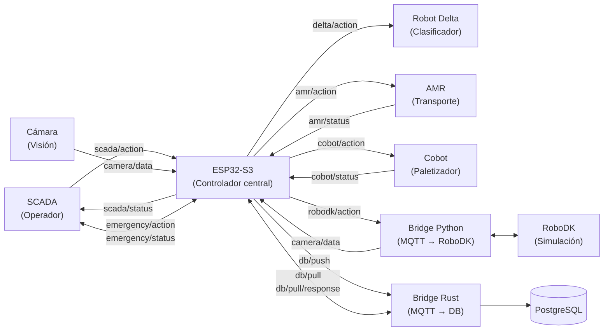
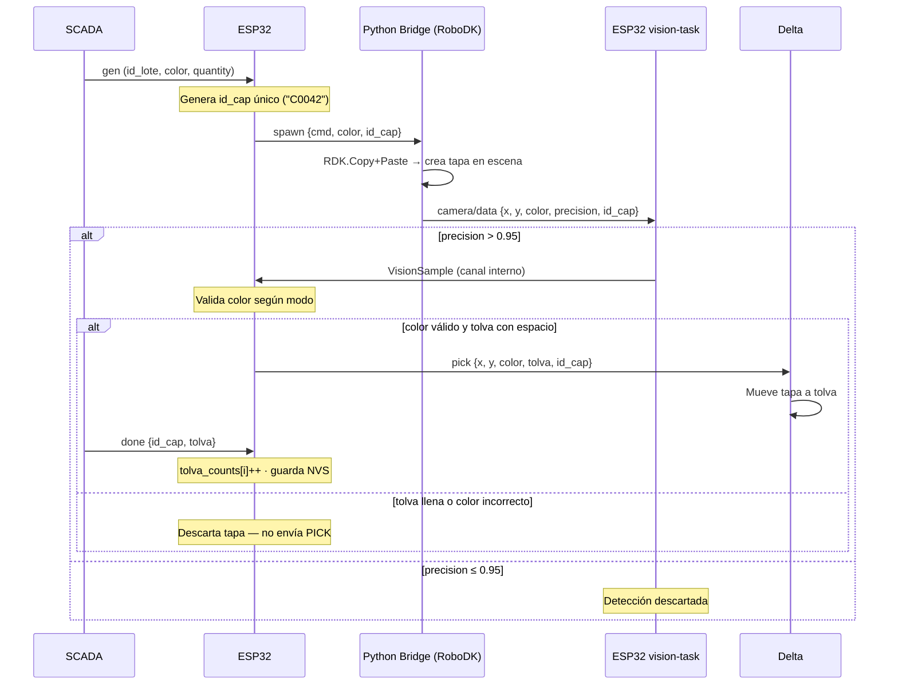
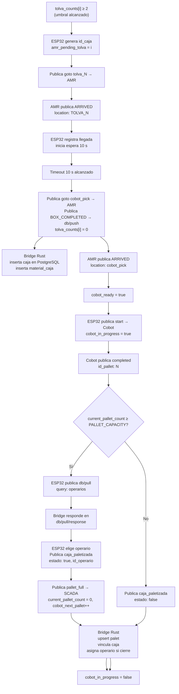
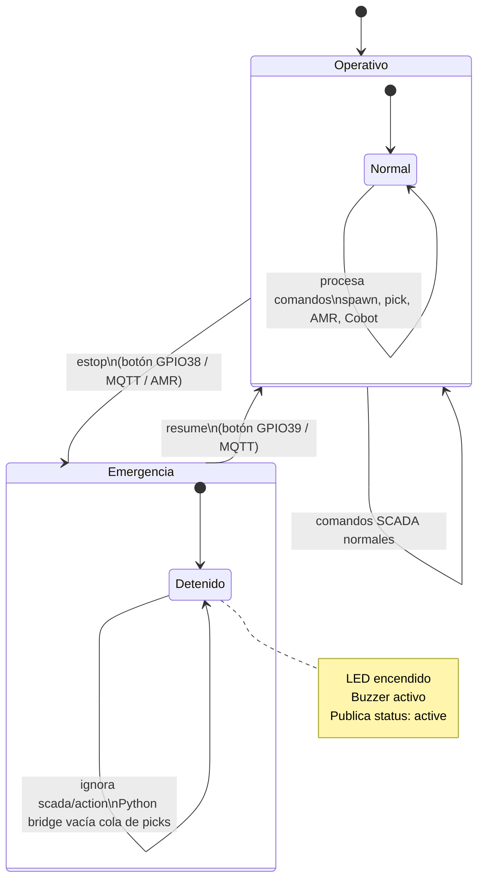
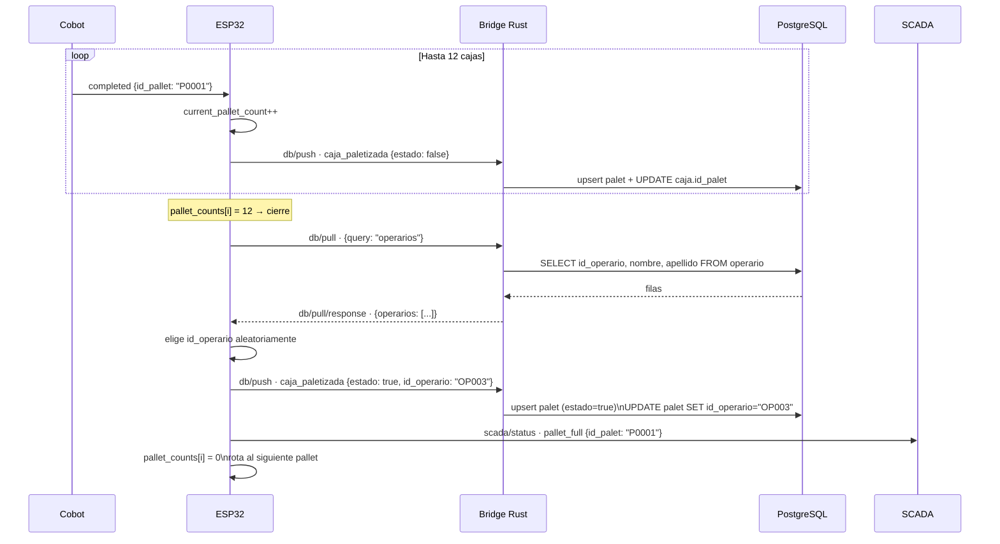
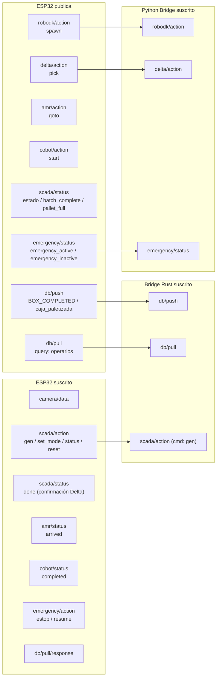

# GIIROB — Diagramas de flujo

---

## 1. Arquitectura general del sistema



---

## 2. Ciclo de vida completo de una tapa



---

## 3. Flujo completo de una caja (AMR + Cobot + DB)



---

## 4. Ciclo de emergencia



---

## 5. Flujo del pallet — cierre con operario



---

## 6. Mapa de topics MQTT



---

## 7. Arquitectura interna del firmware ESP32 (tareas concurrentes)

```mermaid
flowchart TD
    subgraph ESP32["ESP32-S3 — Tareas concurrentes"]
        direction TB

        WM["wifi-manager\n(Core 0)\nConexión y reconexión Wi-Fi"]
        MQTT["mqtt-manager\n(callback driver)\nRecepción y despacho MQTT"]
        VT["vision-task\n(hilo)\nFiltrado de detecciones\nprecision > 0.95"]
        LT["logic-task\n(hilo)\nSpawn · Validación · AMR · Cobot\nbucle cada 500 ms"]
        ET["emergency-task\n(hilo principal)\nGPIO38 estop · GPIO39 resume\nLED · Buzzer"]

        CS[("ControlState\nArc&lt;Mutex&gt;\nEstado compartido")]

        VT -->|VisionSample\n(canal)| LT
        MQTT -->|handle_scada| LT
        MQTT -->|handle_amr| LT
        MQTT -->|handle_cobot| LT
        MQTT -->|handle_emergency| ET

        WM -->|wifi_ready: AtomicBool| MQTT
        LT <--> CS
        VT <--> CS
        ET <--> CS
        MQTT <--> CS
    end

    NVS[("NVS Flash\ntolva_counts")]
    LT -->|guarda| NVS
    LT -->|carga al arrancar| NVS
```
