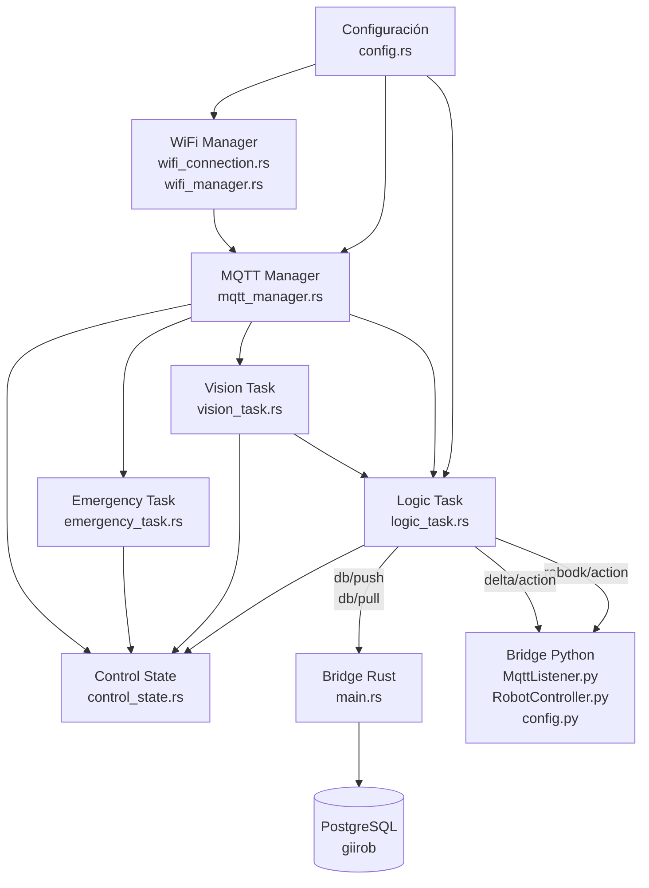
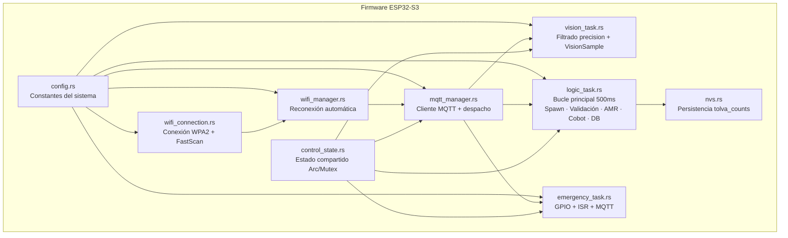
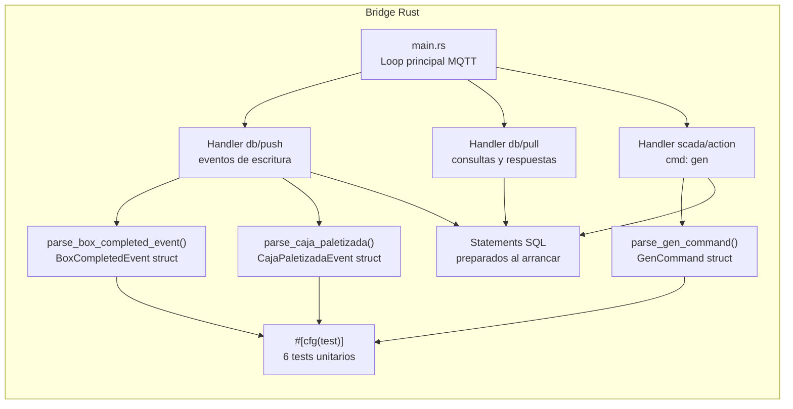
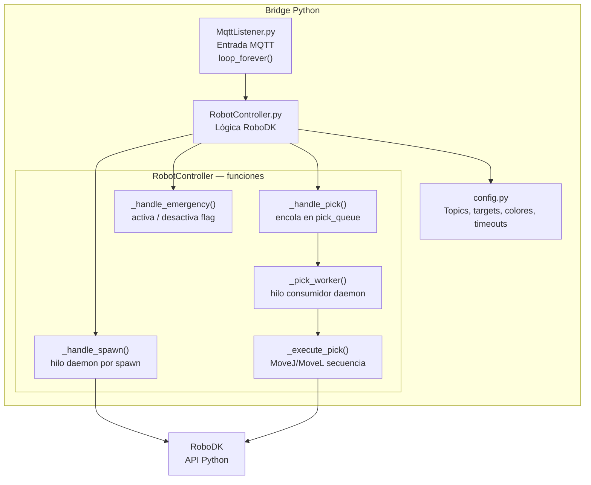
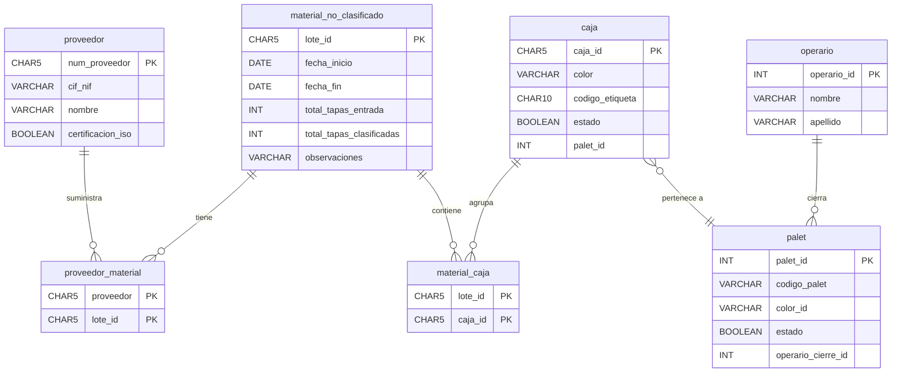

# GIIROB — Tareas del proyecto

Desglose de componentes y tareas de implementación del sistema PR2.

---

## 1. Resumen de componentes

| Componente | Tecnología | Estado |
|---|---|---|
| Firmware ESP32-S3 | Rust (esp-idf-svc) | En desarrollo |
| Bridge MQTT-DB | Rust (tokio, rumqttc, tokio-postgres) | Implementado |
| Bridge Python-RoboDK | Python (paho-mqtt, robodk) | Implementado |
| Base de datos | PostgreSQL | Esquema definido |
| Documentación | Markdown | En progreso |

---

## 2. Diagrama de dependencias entre componentes

---

## 3. Tareas por componente

### 3.1 Firmware ESP32-S3

#### Subtareas pendientes en `logic_task.rs`

| Subtarea | Descripción |
|---|---|
| Generación de `cap_id` | Contador incremental: `cap_1`, `cap_2`, ... |
| Spawn en Auto | Rotación cíclica 6 colores, throttle por `auto_target` |
| Spawn en Manual | Un spawn por comando, validación estricta de color |
| Mapeado color → tolva | red→0, yellow→1, green→2, white→3, orange→4, blue→5 |
| Protección tolva llena | `tolva_counts[i] + pending[i] >= AMR_TOLVA_THRESHOLD` |
| Envío AMR a tolva | Cuando `tolva_counts[i] >= umbral` |
| Espera 10 s post-llegada | Timer con `Instant::now()` |
| Envío AMR a cobot_pick | Tras timeout, junto con `BOX_COMPLETED` |
| Envío orden Cobot | Cuando `cobot_ready && !cobot_in_progress` |
| Rotación de pallets | Índice cíclico 0..5 → id_pallet 10..15 |
| Cierre de pallet | `pallet_counts[i] >= PALLET_CAPACITY` |
| Solicitud operarios (`db/pull`) | Publicar query, suscribirse a respuesta |
| Selección aleatoria de operario | Elegir del array recibido |
| Publicar `caja_paletizada` | Con `estado: true/false` y `operario_id` |
| Publicar `pallet_full` | Al SCADA cuando se cierra un pallet |
| Publicar `batch_complete` | Al completar el lote en modo Auto |
| Publicar estado completo | En respuesta a `status` del SCADA |

---

### 3.2 Bridge Rust (mqtt_db_bridge)

#### Statements SQL implementados

| Statement | Operación |
|---|---|
| `insert_caja_stmt` | INSERT caja ON CONFLICT DO UPDATE (sin palet_id) |
| `insert_material_caja_stmt` | INSERT material_caja ON CONFLICT DO NOTHING |
| `insert_lote_stmt` | INSERT material_no_clasificado ON CONFLICT DO NOTHING |
| `insert_proveedor_material_stmt` | INSERT proveedor_material ON CONFLICT DO NOTHING |
| `upsert_palet_stmt` | INSERT palet ON CONFLICT DO UPDATE (estado) |
| `link_caja_palet_stmt` | UPDATE caja SET palet_id |
| `set_operario_cierre_stmt` | UPDATE palet SET operario_cierre_id |

---

### 3.3 Bridge Python (python_bridge)

#### Estado de issues Python

| Issue | Descripción | Estado |
|---|---|---|
| Race condition Copy/Paste | `_rdk_lock` protege RDK.Copy+Paste | Corregido |
| Cola no vaciada en emergencia | `_set_emergency(True)` drena `pick_queue` | Corregido |
| z hardcoded en pick | `config.PICK_Z` configurable | Corregido |
| Imports innecesarios en MqttListener | Eliminados `robolink`/`robomath` | Corregido |
| `COLOR_TOLVA_MAP` sin usar | Eliminado de config.py | Corregido |

---

## 4. Esquema de base de datos

---

## 5. Flujo de mensajes MQTT por fase del sistema

```mermaid
gantt
    title Secuencia de mensajes en un ciclo completo (tapa → pallet cerrado)
    dateFormat  X
    axisFormat  %s s

    section Generación
    SCADA gen          :milestone, 0, 0
    ESP32 spawn        :1, 2
    RoboDK crea tapa   :2, 4

    section Clasificación
    camera/data        :milestone, 4, 4
    ESP32 valida       :4, 5
    delta/action pick  :5, 6
    Delta mueve tapa   :6, 10
    SCADA done         :milestone, 10, 10

    section AMR (2 tapas por tolva)
    amr/action goto tolva  :10, 11
    AMR en tránsito        :11, 14
    amr/status arrived     :milestone, 14, 14
    ESP32 espera 10s       :14, 24
    amr/action cobot_pick  :24, 25
    db/push BOX_COMPLETED  :24, 25

    section Cobot
    AMR en tránsito cobot  :25, 28
    amr/status arrived     :milestone, 28, 28
    cobot/action start     :28, 29
    Cobot paletiza         :29, 35
    cobot/status finished  :milestone, 35, 35

    section Cierre pallet (12 cajas)
    db/pull operarios      :35, 36
    db/pull/response       :36, 37
    db/push caja_paletizada:37, 38
    scada/status pallet_full:milestone, 38, 38
```

---

## 6. Checklist de entrega

### Firmware ESP32
- [ ] wifi_manager: reconexión automática verificada
- [ ] mqtt_manager: despacho de todos los topics documentados
- [ ] vision_task: filtro de precisión y `cap_id` validado
- [ ] logic_task: flujo completo Auto y Manual
- [ ] logic_task: coordinación AMR y Cobot
- [ ] logic_task: publicación `db/push` y `db/pull`
- [ ] emergency_task: botones físicos + MQTT
- [ ] NVS: persistencia de tolva_counts entre reinicios

### Bridge Rust
- [x] Parsers tipados con structs
- [x] Tests unitarios (6 casos)
- [x] Handler `db/push` (box_completed, caja_paletizada)
- [x] Handler `db/pull` (operarios → response)
- [x] Handler `scada/action` (gen)
- [x] ON CONFLICT correcto (sin borrar palet_id)

### Bridge Python
- [x] MqttListener separado de RobotController
- [x] Spawn con cap_id del ESP32
- [x] Lock en Copy/Paste RoboDK
- [x] Pick queue productor-consumidor
- [x] Emergencia: vaciado de cola
- [x] PICK_Z configurable
- [ ] Ajuste de PICK_Z según la escena real
- [ ] Ajuste de targets en config.py según escena real

### Base de datos
- [ ] Esquema creado y verificado
- [ ] Proveedores y operarios de prueba insertados
- [ ] FKs verificadas (proveedor, lote, operario)

### Documentación
- [x] SISTEMA.md actualizado
- [x] mqtt_messages.md actualizado
- [x] Pruebas.md (bridge)
- [x] Pruebas_sistema.md (sistema completo)
- [x] Diagramas_flujo.md
- [x] Tareas_proyecto.md
